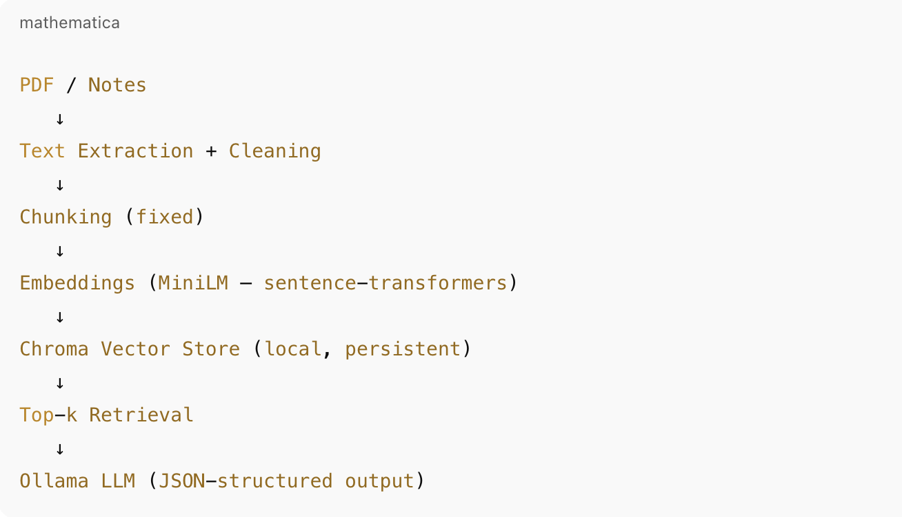
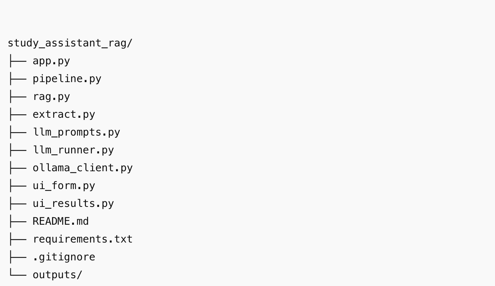

AI Study Assistant (RAG)

A local, grounded AI Study Assistant built using a fixed Retrieval-Augmented Generation (RAG) pipeline.
The system answers questions, generates revision notes, and creates MCQs strictly from provided study material, with transparent sources and exports.

------------------------------

✨ Key Features

Question Answering (QA) from notes / PDFs

Exam-focused revision notes

MCQ generation (optional mode)

Strict grounding

Uses only retrieved context

No hallucination

Explicit “Insufficient context” handling

Transparent sources

Shows top-k retrieved chunks

Displays chunk id + distance

Export

Download full result as JSON

Download readable summary as TXT

------------------------------

🧠 Architecture (Locked by Design)

This project intentionally keeps the architecture simple, explicit, and interview-friendly.



------------------------------

⚠️ Important:
The following are not changed or abstracted:

Chunking logic

Embedding logic

Vector DB logic

Retrieval logic

Only prompts, modes, and UI behavior vary.
------------------------------

🧩 Tech Stack

Python 3.10+

Streamlit – UI

sentence-transformers (MiniLM) – embeddings

ChromaDB – local vector store

Ollama – local LLM inference

No paid APIs

Offline-friendly
------------------------------

Project Structure

## 📁 Project Structure



------------------------------

🚀 How to Run
1. Prerequisites

Python installed

Ollama running locally

Model pulled (example):
```ollama pull mistral:7b```

2. Install dependencies
```pip install -r requirements.txt```

3. Run the app
```streamlit run app.py```

Open:
👉 http://localhost:8501
------------------------------

🧪 Usage Flow
Step 1: Index Notes

Upload a PDF or

Paste study notes

Click Index Notes

Notes are embedded and stored in Chroma

Step 2: Ask

Select mode:

qa

notes

mcq

Enter question / topic

Click Ask

Step 3: Inspect Results

Answer / notes / MCQs

Evidence quotes from notes

Top-k retrieved chunks with distance

Expandable source view

Step 4: Export

Download JSON (full structured output)

Download TXT (human-readable summary)

🛡️ Grounding & Safety Rules

The LLM only sees retrieved chunks

If context is insufficient:

Response explicitly says so

No external knowledge

Output schema enforced via prompt + parser

Evidence is always shown when available

🎤 Interview Talking Points

“This is a pure RAG system, no fine-tuning”

“Grounding is enforced at prompt + UI level”

“Sources are visible to the user”

“Architecture is intentionally simple and explainable”

“Runs fully locally with Ollama + Chroma”

📸 Screenshots

Include:

Index screen

Result screen

Sources expanded

Export buttons

✅ Status

Complete and production-ready for demos & interviews.

No further changes required.


